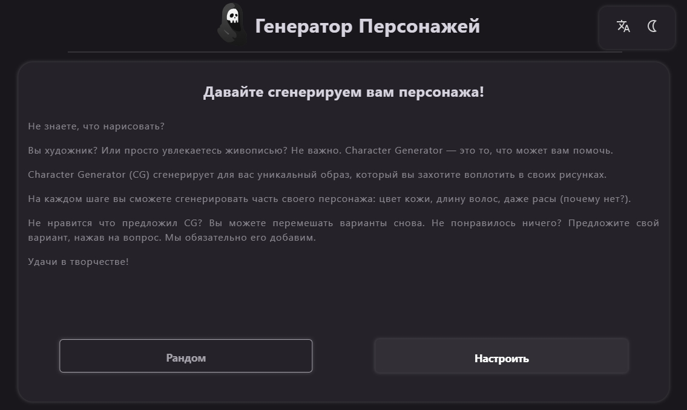
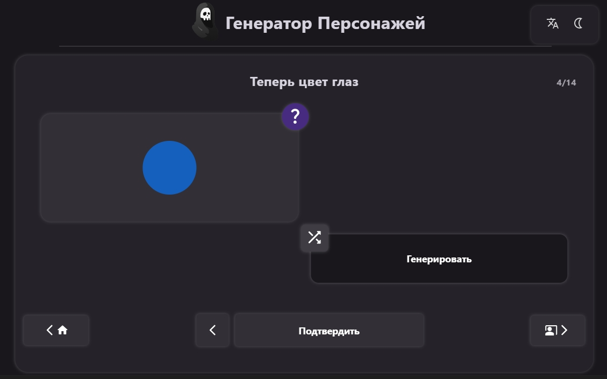
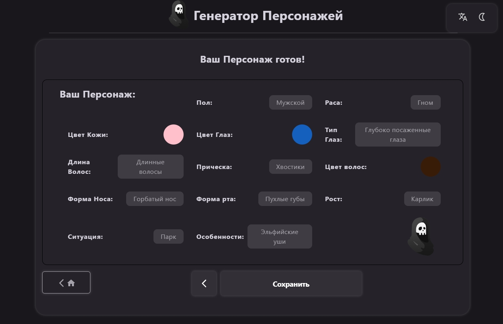
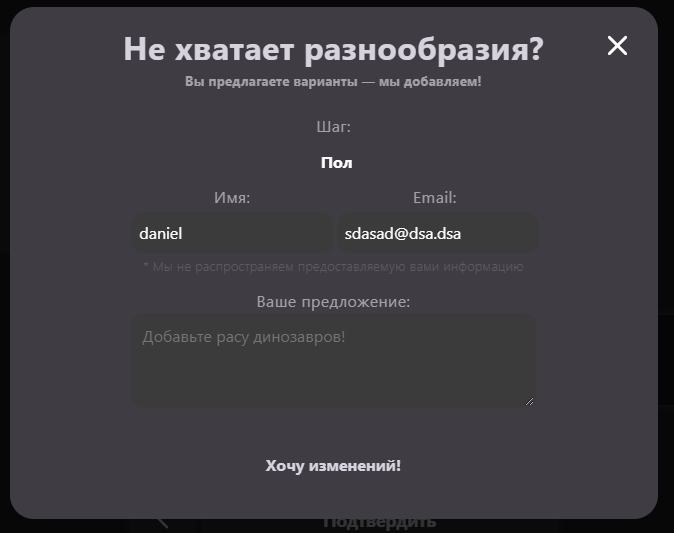
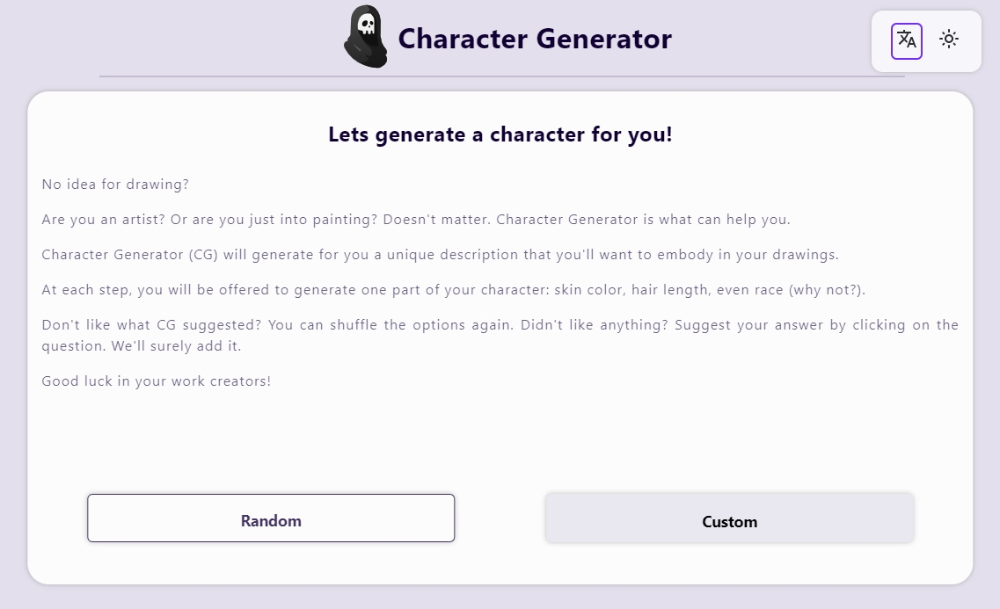
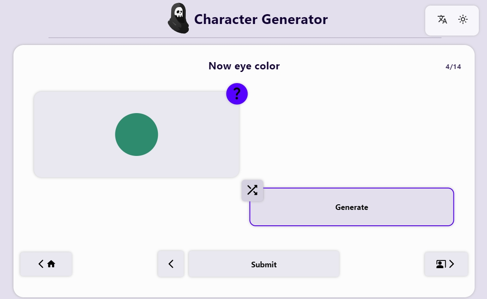
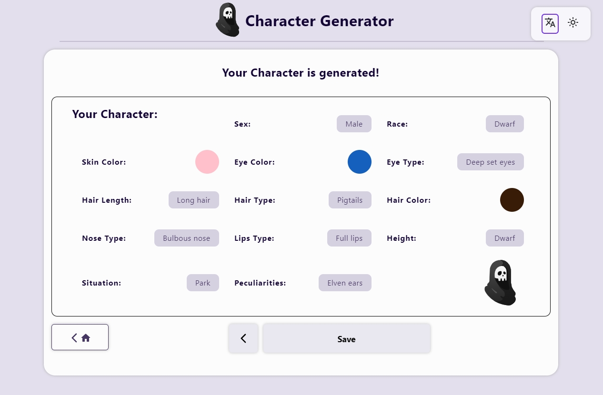

# Character Generator

    Character Generator (CG)
    сгенерирует для вас уникальный образ,
    который вы захотите воплотить
    в своих рисунках.

## **[Ссылка на сайт](https://daniilboyarinkov.github.io/CharacterGenerator/ "Сгенерируй своего персонажа!")**

# Зачем?

Этот проект создан для художников, писателей и других творческих людей, у которых часто возникает необходимость придумывать сказочных или просто очень странных персонажей.

# Поддерживаемые языки

- Русский
- Английский
- Французский

# Темы

- Тёмная
- Светлая

# Функционал

- Генерация персонажа со случайными параметрами
- Возможность пошаговой настройки персонажа
- Возможность регулировки определенной характеристики
- Быстрая навигация между шагами настройки
- Возможность связаться с разработчиком для добавления в проект новых идей

# Как?

Проект выполнен с помощью React и Redux.

Во время выполнения проекта также использовалось:

- React Context
- React Spring
- EmailJS
- Custom React Hooks
- ImgToCanvas Library
- useLocalStorage
- EsLint
- Prettier
- StyleLint
- VS code env configs
- Yarn PM

# Refactor Time!

Спустя пол года после завершения проекта я вновь вернулся к нему с новым видением и новыми знаниями.  
Разобрался с тем как все здесь работало и переписал самописный контроллер состояний на Redux.  
Ну и обновил дизайн. вроде стало посвежее.

# Дизайн

Ручная настройка персонажа.  
Для любителей потыкать

Готово!

Есть идеи или предложения?  
Пиши!

# А теперь то же самое только белое

Ручная настройка персонажа.  
Для любителей потыкать

Готово!

# А что было до этого

А я вам покажу. 

Вот так оно и было.

---

> I'm just learning
